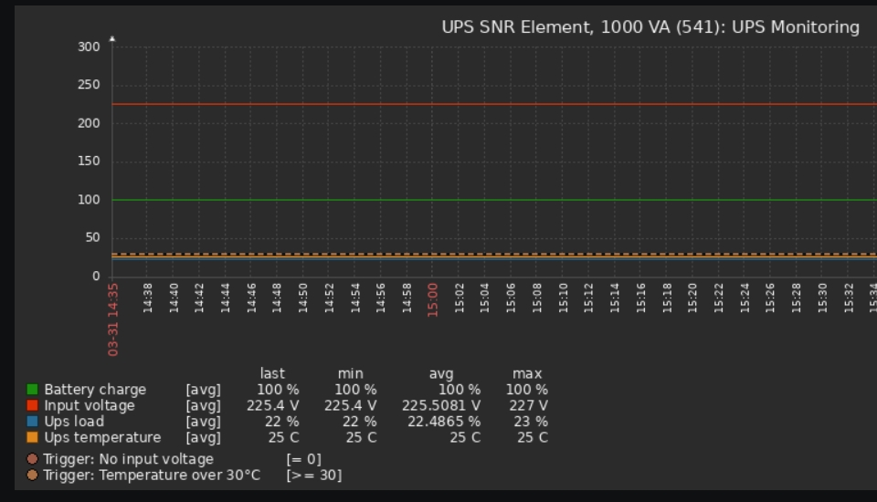

This repository will help you quickly deploy SNR-UPS-ONRM-1000-XL24 UPS monitoring.



Soft:
- Zabbix 5.4
- CentOS 8
- Nut 2.8.0-3.el8

1. Install Nut:

```bash
sudo yum install nut
sudo systemctl enable nut-monitor.service
```

2. Add to config, change the values "default.battery.*" to your liking
```bash
# run as root user
cat << EOF > /etc/ups/ups.conf
[snr]
driver = blazer_usb
langid_fix = 0x409
port = auto
vendorid = 0001
productid = 0000
default.battery.voltage.nominal = 12
default.battery.voltage.low = 10.4
default.battery.voltage.high = 14
```

3. Restart Nut
```bash
sudo systemctl restart nut-monitor.service
```

4. Run test
```bash
upsc snr@localhost 
```
The output should be something like this
```bash
Init SSL without certificate database
battery.charge: 100
battery.voltage: 13.80
battery.voltage.high: 13
battery.voltage.low: 10.4
battery.voltage.nominal: 12.0
device.mfr: 
device.model: 
device.type: ups
driver.name: blazer_usb
driver.parameter.langid_fix: 0x409
driver.parameter.pollinterval: 2
driver.parameter.port: auto
driver.parameter.productid: 0000
driver.parameter.synchronous: auto
driver.parameter.vendorid: 0001
driver.version: 2.8.0
driver.version.internal: 0.14
driver.version.usb: libusb-1.0.23 (API: 0x1000107)
input.current.nominal: 5.0
input.frequency: 50.1
input.frequency.nominal: 50
input.voltage: 225.4
input.voltage.fault: 210.9
input.voltage.nominal: 220
output.voltage: 220.5
ups.beeper.status: enabled
ups.delay.shutdown: 30
ups.delay.start: 180
ups.firmware:        V04
ups.load: 22
ups.mfr: 
ups.model: 
ups.productid: 0000
ups.status: OL
ups.temperature: 25.0
ups.type: online
ups.vendorid: 0001
```

5. Create script file
copy this code to bash:
```bash
cat << EOF > ~/ups.sh
#!/usr/bin/env bash

ZABBIX_SERVER="127.0.0.1"
ZABBIX_PORT="10051"
ZABBIX_SENDER="/usr/bin/zabbix_sender"
HOST="UPS"
COMMAND_READ_DATA="/usr/bin/upsc snr@localhost"

$COMMAND_READ_DATA | while read -r line
do
  if [[ $line =~ .*.\..*.: ]]; then
    KEY=$(echo "$line"| cut -d ":" -f 1)
    VALUE=$(echo "$line"| cut -d ":" -f 2 | sed 's/ //g')
    if [ ! -z "${VALUE}" ]; then
      $ZABBIX_SENDER -z "${ZABBIX_SERVER}" -p "${ZABBIX_PORT}" -s "${HOST}" -k "${KEY}" -o "${VALUE}"
    fi
  fi
done
EOF
```

6. Add cron entry
```bash
crontab -l
* * * * * ~/ups.sh
```

7. Import zabbix template [ups.yaml](ups.yaml)

That's all ;)